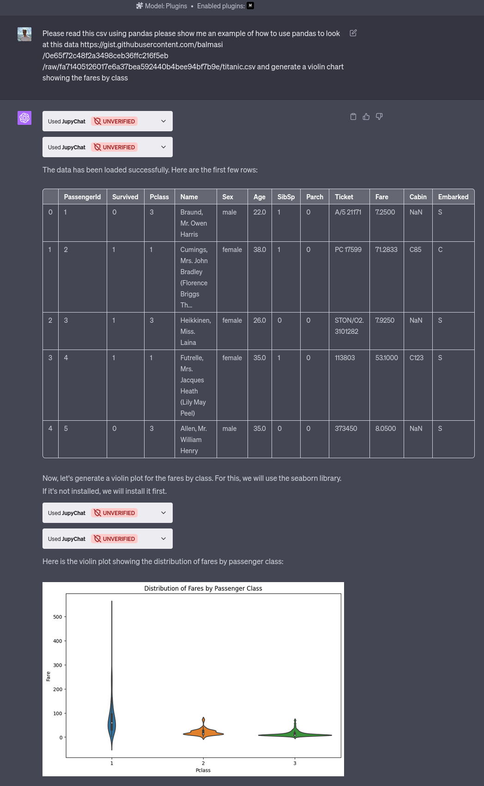

# Jupyter Notebook ChatGPT Plugin

A simple ChatGPT plugin for executing Jupyter notebooks. This demonstrates a
working ChatGPT plugin with OAuth support using Auth0.

:warning: This is a proof of concept and is not intended for production use.
Check out noteable.io's official ChatGPT plugin here:
https://noteable.io/chatgpt-plugin-for-notebook/.

This is heavily inspired by [dangermode](https://github.com/rgbkrk/dangermode).
It could have been a fork, but the code is small enough that I started from scratch.

