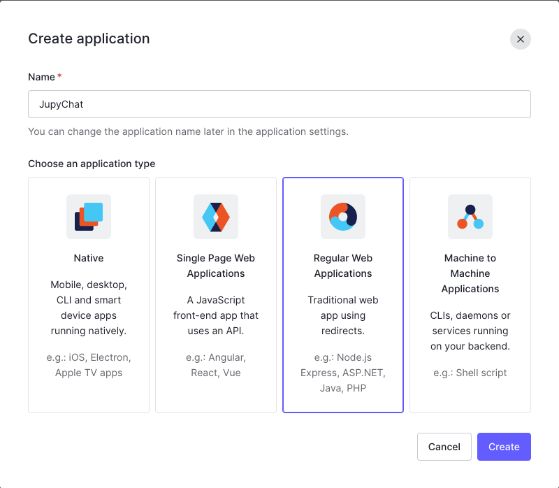
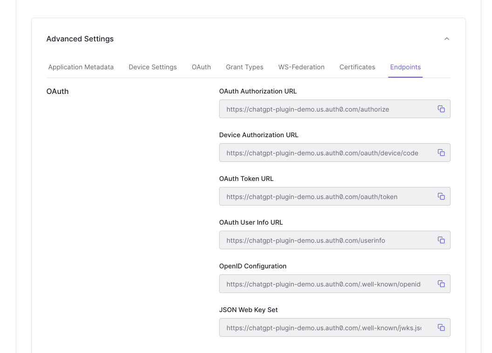
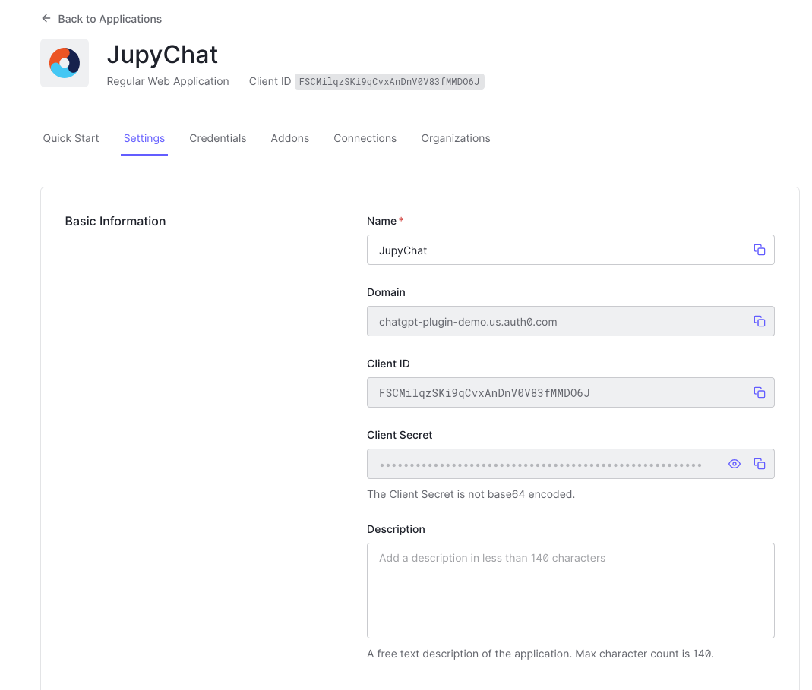
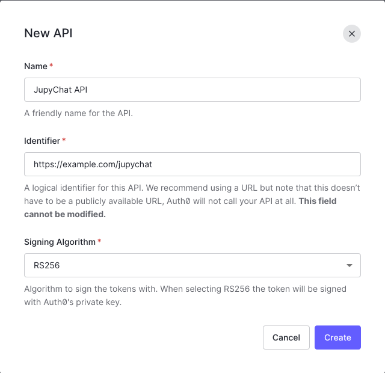

# Set up your Auth0 Account for JupyChat

## Create an Auth0 Account

1. Go to [Auth0](https://auth0.com/) and create an account.

## Create an Auth0 Application

1. Go to your [Auth0 Dashboard](https://manage.auth0.com/dashboard/) and click "Applications" in the left sidebar.
2. Select "Regular Web Application" and click "Create".

## Get your endpoints

1. Select the "Settings" tab for your application and scroll to the bottom
2. Expand "Advanced Settings"

## Get your credentials

1. Select the "Settings" tab for your application
2. Select the "Client ID" and "Client Secret"

## Create an API

1. Go to your [Auth0 Dashboard](https://manage.auth0.com/dashboard/) and click "APIs" in the left sidebar.
2. Click "Create API"
3. Use `https://example.com/jupychat` as the identifier and audience

